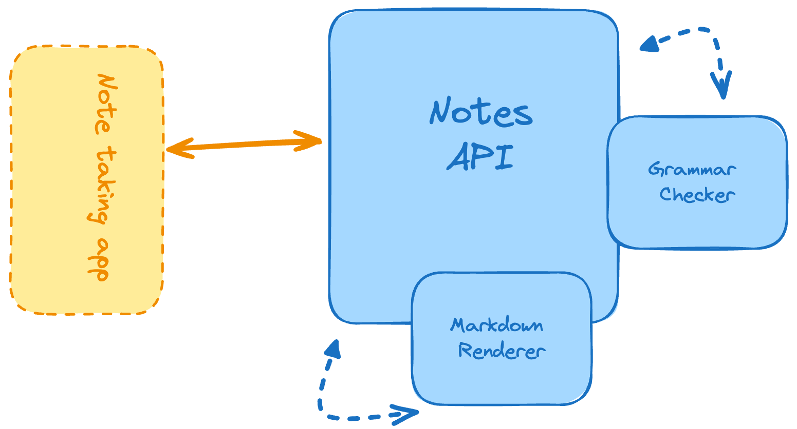

# Note-Taking-App

This is a simple note-taking application built with Spring Boot that allows users to:

- Create and save notes.
- Upload notes from markdown files.
- Render markdown notes into HTML.
- Check grammar of notes using LanguageTool.



## Getting Started

### Prerequisites

- Java 21
- Maven
- MySQL

### Installation

1. Clone the repository: git clone https://github.com/Developer-Roadmap-aizwal/Markdown-Note-taking-App.git
2. Navigate to the project directory: cd Note-Taking-App
3. Create a MySQL database named `notes`.
4. Update the database credentials in `src/main/resources/application.properties`.
5. Build the project: mvn clean install
6. Run the application: mvn spring-boot:run
7. The application will start on port 8005.

## API Endpoints

### Notes

- `POST /notes`: Create a new note.
- `POST /notes/{noteId}/check-grammar`: Check grammar of a note.
- `POST /notes/{noteId}/render`: Render a note in HTML.
- `POST /notes/upload`: Upload a note from a markdown file.

## Usage

1. Access the application through a web browser or API client.
2. Use the API endpoints to interact with the application.

## Example

### Create a note:
```bash
curl -X POST -H "Content-Type: application/json" -d '{"title": "My Note", "content": "This is my note."}' http://localhost:8005/ notes
```
### Check grammar of a note:
```bash
curl -X POST http://localhost:8005/ notes/ 1/ check- grammar
```
### Render a note in HTML:
```bash
curl -X POST http://localhost:8005/ notes/ 1/ render
```
### Upload a note from a markdown file:
```bash
curl -X POST -F "file=@my-note.md" http://localhost:8005/ notes/ upload
```
## Technologies Used

- Spring Boot
- Spring Data JPA
- MySQL
- Flexmark
- LanguageTool
